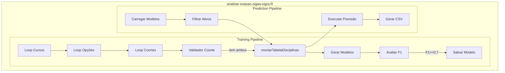

# C4 — Diagrama de Componentes

> Gerado pelo Arquiteto em 2026-05-02

---

## Componentes do Sistema

---

## Componentes — Módulo de Treinamento

### 1. Loop de Cursos

| Aspecto | Detalhe |
|---------|---------|
| **Responsabilidade** | Iterar sobre todos os cursos (Ciência Política, etc.) |
| **Entrada** | Lista de cursos da query |
| **Saída** | Curso atual para o loop de opções |
| **Localização** | `analisar-evasao-sigaa-sigra.R:91` |

### 2. Loop de Opções

| Aspecto | Detalhe |
|---------|---------|
| **Responsabilidade** | Iterar sobre turnos (manhã, tarde, noite) |
| **Entrada** | Opções do curso |
| **Saída** | Opção atual para o loop de coortes |
| **Localização** | `analisar-evasao-sigaa-sigra.R:117` |

### 3. Loop de Coortes

| Aspecto | Detalhe |
|---------|---------|
| **Responsabilidade** | Iterar sobre ano + período de ingresso |
| **Entrada** | Coortes da opção |
| **Saída** | Coorte atual |
| **Localização** | `analisar-evasao-sigaa-sigra.R:132` |

### 4. Validador de Coorte

| Aspecto | Detalhe |
|---------|---------|
| **Responsabilidade** | Verificar se coorte tem alunos FORMADO e EVADIDO |
| **Regra** | Sem ambas as classes, não é possível treinar |
| **Localização** | `analisar-evasao-sigaa-sigra.R:135` |
| **Confiança** | 🟢 CONFIRMADO |

### 5. Montar Tabela de Disciplinas

| Aspecto | Detalhe |
|---------|---------|
| **Responsabilidade** | Criar pivô aluno × disciplinas |
| **Entrada** | Dados de alunos e disciplinas |
| **Saída** | DataFrame com contagem por disciplina |
| **Localização** | `tratamento_dados.R:25-42` |
| **Confiança** | 🟢 CONFIRMADO |

### 6. Gerar Modelos

| Aspecto | Detalhe |
|---------|---------|
| **Responsabilidade** | Treinar 5 tipos de modelo |
| **Modelos** | C5.0, Random Forest, RPart, Regressão Logística, Rede Neural |
| **Localização** | `analisar-evasao-sigaa-sigra.R:177-349` |
| **Confiança** | 🟢 CONFIRMADO |

### 7. Avaliador F1

| Aspecto | Detalhe |
|---------|---------|
| **Responsabilidade** | Calcular F1-Score via confusionMatrix |
| **Threshold** | F1 >= 0.7 para aceitar |
| **Localização** | `analisar-evasao-sigaa-sigra.R:177, 227, 266, 308, 349` |
| **Confiança** | 🟢 CONFIRMADO |

---

## Componentes — Módulo de Previsão

### 1. Carregar Modelos

| Aspecto | Detalhe |
|---------|---------|
| **Responsabilidade** | Carregar modelos .Rdata do disco |
| **Localização** | `analisar-evasao-sigaa-sigra.R:560-565` |
| **Confiança** | 🟢 CONFIRMADO |

### 2. Filtrar Ativos

| Aspecto | Detalhe |
|---------|---------|
| **Responsabilidade** | Selecionar alunos com status = ATIVO |
| **Regra** | RN-009: Previsão apenas para ativos |
| **Localização** | `analisar-evasao-sigaa-sigra.R:586-593` |
| **Confiança** | 🟢 CONFIRMADO |

### 3. Executar Previsão

| Aspecto | Detalhe |
|---------|---------|
| **Responsabilidade** | Aplicar modelo treinado aos dados |
| **Saída** | Probabilidade de evasão |
| **Localização** | `analisar-evasao-sigaa-sigra.R:595-600` |
| **Confiança** | 🟢 CONFIRMADO |

---

## Componentes — tratamento_dados.R

| Componente | Função | Confiança |
|------------|--------|-----------|
| incluir_Situacao | Transforma status → FORMADO/EVADIDO | 🟢 |
| montarTabelaDisciplinas | Cria pivô | 🟢 |
| inserirDisplinasCursadas | Preenche contagens | 🟢 |
| inserirSituacaoAluno | Insere target | 🟢 |
| selecionarDisplinasPorOpacao | Filtro por tipo | 🟢 |
| selecionarAlunos | Filtro por curso/coorte | 🟢 |
| selecinarCursos | Lista cursos | 🟢 |
| selecionarAlunosAtivosOpco | Filtro ativos | 🟢 |

---

## Escalas de Confiança

| Componente | Confiança |
|------------|-----------|
| Loops de treinamento | 🟢 CONFIRMADO |
| Validador de coorte | 🟢 CONFIRMADO |
| Pipeline ML | 🟢 CONFIRMADO |
| Pipeline previsão | 🟢 CONFIRMADO |
| Funções tratamento_dados | 🟢 CONFIRMADO |

---

## Ver Também

- [c4-containers.md](c4-containers.md) — Diagrama de Containers
- [architecture.md](architecture.md) — Arquitetura geral
- [domain.md](domain.md) — Regras de negócio