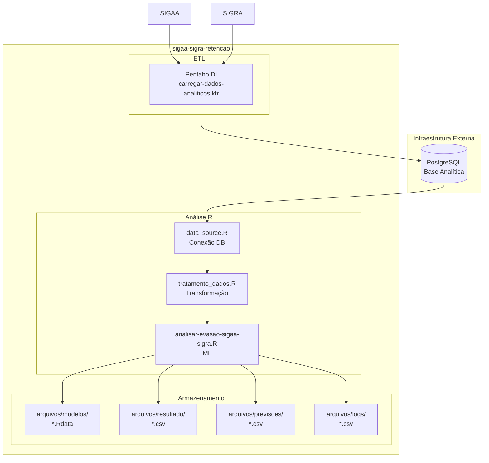

# C4 — Diagrama de Containers

> Gerado pelo Arquiteto em 2026-05-02

---

## Visão de Containers



---

## Descrição dos Containers

### 1. ETL Pentaho

| Aspecto | Detalhe |
|---------|---------|
| **Tipo** | Transformação de dados (Kettle) |
| **Tecnologia** | Pentaho Data Integration |
| **Responsabilidade** | Extrair dados do SIGAA/SIGRA e carregar na base analítica |
| **Entrada** | Queries do SIGAA/SIGRA |
| **Saída** | Tabela `base_analitica.alunos_sigaa_sigra_27092022` |
| **Porta** | N/A (executado via linha de comando) |

### 2. data_source.R

| Aspecto | Detalhe |
|---------|---------|
| **Tipo** | Script R |
| **Tecnologia** | R + RPostgres |
| **Responsabilidade** | Estabelecer conexão PostgreSQL e executar queries |
| **Funções** | `conectar()`, `desconectar()`, `le_dados()`, `le_dados1()`, `le_dados2()` |
| **Saída** | DataFrames com dados do banco |

### 3. tratamento_dados.R

| Aspecto | Detalhe |
|---------|---------|
| **Tipo** | Script R |
| **Tecnologia** | R + tidyverse (dplyr) |
| **Responsabilidade** | Transformar dados brutos em tabela pivô para modelo ML |
| **Funções** | `incluir_Situacao()`, `montarTabelaDisciplinas()`, `inserirDisplinasCursadas()`, etc. |
| **Saída** | DataFrame pivô (aluno × disciplinas × situação) |

### 4. analisar-evasao-sigaa-sigra.R

| Aspecto | Detalhe |
|---------|---------|
| **Tipo** | Script R |
| **Tecnologia** | R + caret + h2o + ranger + C50 + rpart |
| **Responsabilidade** | Treinar e executar modelos preditivos de evasão |
| **Funções** | `gerar_modelos()`, `realizar_previsao()` |
| **Modelos** | C5.0, Random Forest, RPart, Regressão Logística, Rede Neural |
| **Saída** | Arquivos .Rdata, CSV com métricas e previsões |

---

## Fluxo de Dados entre Containers

```
Pentaho (ETL)
    │
    ▼
PostgreSQL (Base Analítica)
    │
    ▼
data_source.R (Conexão)
    │
    ▼
tratamento_dados.R (Transformação)
    │
    ▼
analisar-evasao-sigaa-sigra.R (ML)
    │
    ├─► Modelos (.Rdata)
    ├─► Resultado (métricas .csv)
    ├─► Previsão (alunos .csv)
    └─► Logs (erros .csv)
```

---

## Escalas de Confiança

| Container | Confiança |
|-----------|-----------|
| ETL Pentaho | 🟢 CONFIRMADO |
| data_source.R | 🟢 CONFIRMADO |
| tratamento_dados.R | 🟢 CONFIRMADO |
| analisar-evasao-sigaa-sigra.R | 🟢 CONFIRMADO |
| Arquivos de saída | 🟢 CONFIRMADO |

---

## Ver Também

- [c4-context.md](c4-context.md) — Diagrama de Contexto
- [c4-components.md](c4-components.md) — Diagrama de Componentes
- [architecture.md](architecture.md) — Arquitetura geral