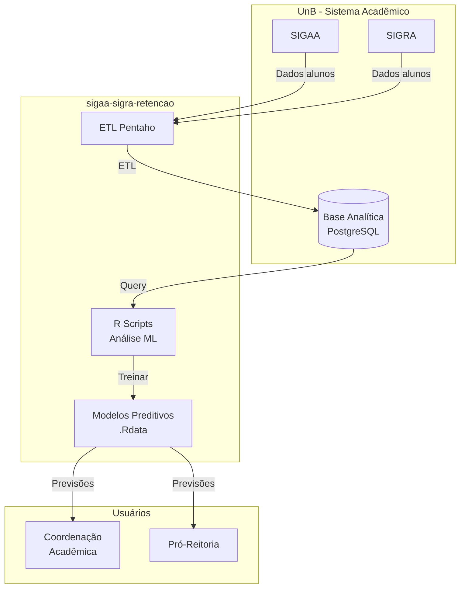

# C4 — Diagrama de Contexto

> Gerado pelo Arquiteto em 2026-05-02

---

## Sistema no Contexto

---

## Descrição dos Elementos

| Elemento | Descrição | Tipo |
|----------|-----------|------|
| **SIGAA** | Sistema de Informação Acadêmica | Sistema externo |
| **SIGRA** | Sistema de Gestão Acadêmica | Sistema externo |
| **Base Analítica** | Warehouse com dados consolidados | Banco de dados |
| **ETL Pentaho** | Pipeline de extração e carga | Processo |
| **R Scripts** | Scripts de análise e ML | Aplicação |
| **Modelos Preditivos** | Modelos treinados armazenados | Dados |
| **Coordenação** | Usuário que recebe previsões | Pessoa |
| **Pró-Reitoria** | Gestão acadêmica institucional | Pessoa |

---

## Relacionamentos

| De | Para | Dados |
|----|------|-------|
| SIGAA | ETL | Alunos, disciplinas, notas |
| SIGRA | ETL | Alunos, disciplinas, notas |
| ETL | Base Analítica | Dados consolidados |
| Base Analítica | R Scripts | Dados para análise |
| R Scripts | Modelos | Modelos treinados |
| Modelos | Coordenação | Alunos em risco |
| Modelos | Pró-Reitoria | Relatórios de evasão |

---

## Escalas de Confiança

| Elemento | Confiança |
|----------|-----------|
| SIGAA como fonte | 🟢 CONFIRMADO |
| SIGRA como fonte | 🟢 CONFIRMADO |
| Base Analítica PostgreSQL | 🟢 CONFIRMADO |
| ETL Pentaho | 🟢 CONFIRMADO |
| R Scripts | 🟢 CONFIRMADO |
| Coordenação/Pró-Reitoria | 🟡 INFERIDO — baseado em suposições de uso |

---

## Ver Também

- [architecture.md](architecture.md) — Visão geral arquitetural
- [c4-containers.md](c4-containers.md) — Diagrama de Containers