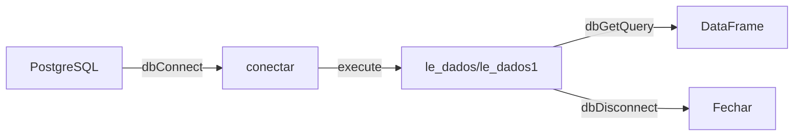
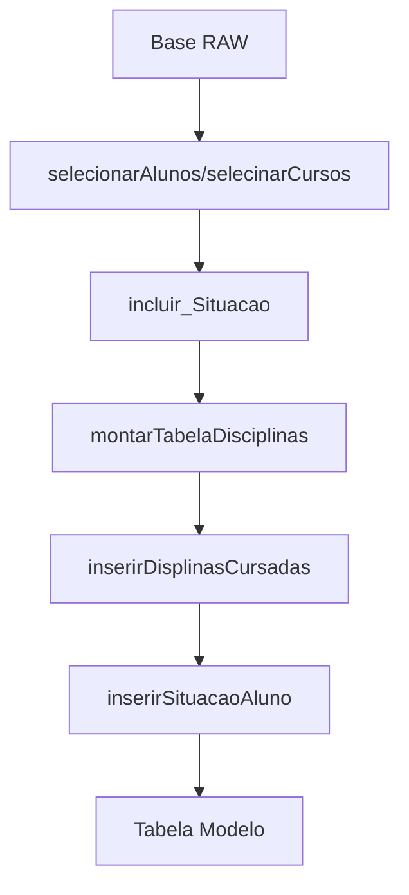

# Análise de Código — sigaa-sigra-retencao

> Gerado pelo Archaeologist em 2026-05-01

---

## 1. Módulo: data_source (Conexão PostgreSQL)

### 1.1 Visão Geral

**Arquivo:** `data_source.R`
**Linguagem:** R
**Dependências:** RPostgres

### 1.2 Queries SQL Definidas

O módulo define 10 queries SQL como objetos globais para extração de dados:

| Query | Finalidade | Campus | Fonte |
|-------|------------|--------|-------|
| `sigaa` | Treinamento | FGA | SIGAA |
| `sigra` | Treinamento | FGA | SIGRA |
| `sigaa_ativos` | Previsão | FGA | SIGAA |
| `sigaa_sigra_todos` | Previsão | FGA | SIGAA+SIGRA |
| `sigaa_sigra_cp` | Treinamento | - | Ciência Política |
| `sigaa_sigra_cp_todos` | Previsão | - | Ciência Política |
| `sigaa_cp_ativos` | Previsão | - | Ciência Política |
| `sigaa_sigra_unb` | Treinamento | != FGA | UnB |
| `sigaa_sigra_unb_todos` | Previsão | != FGA | UnB |
| `sigaa_unb_ativos` | Previsão | != FGA | SIGAA |

**Tabela de origem:** `base_analitica.alunos_sigaa_sigra_27092022`

### 1.3 Funções

```r
conectar() -> connection
```
Estabelece conexão com PostgreSQL (localhost:5432, db: postgres)

```r
desconectar(conexao) -> void
```
Desconecta do banco

```r
le_dados(conexao, strQuery) -> dataframe
```
Executa query e desconecta automaticamente (🔴 LACUNA: não retorna a conexão)

```r
le_dados1(conexao, sql) -> dataframe
```
Idêntico a `le_dados` (🔴 LACUNA: código duplicado)

```r
le_dados2(conexao, strQuery, strWhere) -> dataframe
```
Executa query com parâmetros via `dbBind` (🔴 LACUNA: usa variável `con` hardcoded em vez de `conexao`)

### 1.4 Fluxo de Dados



### 1.5 Credenciais Hardcoded

| Campo | Valor |
|-------|-------|
| Host | localhost |
| Port | 5432 |
| DB | postgres |
| User | postgres |
| Password | 123456 |

🟡 **INFERIDO:** Não há gerenciamento de configuração (devem ser externalizadas)

---

## 2. Módulo: tratamento_dados (Transformação)

### 2.1 Visão Geral

**Arquivo:** `tratamento_dados.R`
**Linguagem:** R
**Dependências:** tidyverse (dplyr)

### 2.2 Funções de Transformação

#### incluir_Situacao(dados) → dataframe

**Descrição:** Transforma status_discente em binário (FORMADO/EVADIDO)

**Lógica:**
```r
situacao = ifelse(
  status_discente == "ATIVO - FORMANDO" | 
  status_discente == "CONCLUÍDO" | 
  status_discente == "Formatura" | 
  status_discente == "FORMADO",
  "FORMADO",
  "EVADIDO"
)
```

🟢 **CONFIRMADO** — direto do código

#### montarTabelaDisciplinas(dfAlunos, dfDisciplinas) → dataframe

**Descrição:** Cria matriz pivô alunos × disciplinas

**Saída:** DataFrame com:
- Linhas: matrículas dos alunos
- Colunas: códigos de disciplinas + coluna `situacao`
- Valores: contagem de vezes que o aluno cursou cada disciplina

#### inserirDisplinasCursadas(dfDados, dfTabela) → dataframe

**Descrição:** Preenche a matriz com contagens de disciplinas por aluno

**Algoritmo:**
```r
para cada aluno:
  contar disciplinas cursadas (summary por fator)
  atualizar linha na tabela
```

#### inserirSituacaoAluno(dfDados, dfTabela) → dataframe

**Descrição:** Insere a situação (FORMADO/EVADIDO) na tabela do modelo

**Lógica:** Faz group_by por matricula, pegando a primeira situação (distinct)

#### selecionarDisplinasPorOpacao(dfDados, dfFiltro, tpDisciplina) → dataframe

**Descrição:** Filtra disciplinas por opção de curso e tipo de integralização

#### selecionarAlunos(dfDados, dfFiltro, tpDisciplina) → dataframe

**Descrição:** Filtra alunos por opção, curso, coorte (ano_ingresso, periodo_ingresso) e tipo

#### selecinarCursos(dfDados, tp_integralizacao) → dataframe

**Descrição:** Lista opções de cursos distintas com suas coortes

#### selecionarAlunosAtivosOpco(dfDados, vIntegralizacao, vOpcao, vNome_Curso, vAno, vPerido) → dataframe

**Descrição:** Filtra alunos ativos para previsão

### 2.3 Fluxo de Transformação



---

## 3. Módulo: analise_ml (Machine Learning)

### 3.1 Visão Geral

**Arquivo:** `analisar-evasao-sigaa-sigra.R`
**Linguagem:** R
**Dependências:** C50, h2o, ranger, rpart, caret, tidyverse

### 3.2 Funções Principais

#### gerar_modelos() → void

**Descrição:** Treina 5 tipos de modelos para cada coorte de curso

**Modelos treinados:**
| Modelo | Biblioteca | Notas |
|--------|------------|-------|
| C5.0 | C50 | Árvore de decisão |
| Random Forest | ranger | Random Forest |
| RPart | rpart | Árvore CART |
| Regressão Logística | glm | binária |
| Rede Neural | h2o.deeplearning | hidden=c(100), epochs=1000 |

**Critério de aceitação:** F1 >= 0.7

**Loop principal:**
```
para cada curso:
  para cada opção (turno):
    para cada coorte (ano/periodo):
      se (FORMADO e EVADIDO existentes):
        monta tabela disciplinas
        treina 5 modelos
        salva se F1 >= 0.7
```

🟢 **CONFIRMADO** — direto do código

#### realizar_previsao() → void

**Descrição:** Aplica modelos treinados a alunos ativos

**Lógica:**
```
para cada curso:
  carrega modelos treinamento
  para cada modelo válido:
    filtra alunos ativos da coorte
    monta tabela disciplinas
    executa previsão
    marca como EVADIDO se aplicável
```

### 3.3 Estrutura da Tabela de Modelo

| Coluna | Tipo | Descrição |
|--------|------|-----------|
| Linha | matricula | Aluno |
| Colunas 1..N | integer | Contagem por disciplina |
| Coluna N+1 | factor | situacao (FORMADO/EVADIDO) |

### 3.4 Métricas Avaliadas

- **F1-Score** (byClass[7] da confusionMatrix)
- Threshold: >= 0.7 para aceitar modelo

### 3.5 Saída de Arquivos

| Diretório | Arquivo | Conteúdo |
|-----------|---------|----------|
| `arquivos/modelos/` | `modelos_treinados_*.Rdata` | Modelos R |
| `arquivos/resultado/` | `modelo_resultado_*.csv` | Métricas por coorte |
| `arquivos/previsoes/` | `previsao_evasao_*.csv` | Alunos previstos como evadidos |
| `arquivos/logs/` | `log_prev_*.csv` | Erros durante previsão |

---

## 4. Módulo: sql_queries (Consultas SQL)

### 4.1 Visão Geral

**Arquivo:** `SQL/UNION_SIGAA_SIGRA.sql`
**Linguagem:** SQL (PostgreSQL)

### 4.2 Query de União

```sql
SELECT ... FROM base_analitica.sigaa_27092022
UNION ALL
SELECT ... FROM base_analitica.sigra_27092022
LEFT JOIN base_analitica.codigos_disciplinas_sigaa
```

**Colunas:**
- Aluno: matricula, id_pessoa, sexo, data_nascimento, nacionalidade, raca, estado_civil
- Curso: nome_curso, periodo_curso, opcao, sigla_campus, nome_campus
- Disciplina: codigo_comp_curricular, nome_comp_curricular, tipo_integralizacao, conceito, numero_faltas
- Metadata: fonte (sigaa/sigra)

### 4.3 Arquivos SQL Adicionais

| Arquivo | Conteúdo |
|---------|----------|
| `DADOS_SIGAA.sql` | Query detalhada do SIGAA com todos os JOINs |
| `DADOS_SIGRA.sql` | Query do SIGRA |
| `PROCEDURE_ATUALIZA_OPCAO_SIGRA.sql` | Stored procedure |
| `TESTES_25_09.sql` | Testes/validações |

---

## 5. Módulo: etl_pentaho (ETL)

### 5.1 Visão Geral

**Arquivo:** `pentaho/transforms/carregar-dados-analiticos.ktr`
**Ferramenta:** Pentaho Data Integration

### 5.2 Descrição

Transformação Kettle para extrair dados do SIGAA/SIGRA e carregar no warehouse analítico `base_analitica`.

---

## 6. Resumo de Entidades

| Módulo | Entidades | Funções |
|--------|-----------|---------|
| data_source | 10 queries, 1 conexão | 4 funções |
| tratamento_dados | 0 entidades | 8 funções |
| analise_ml | 5 tipos de modelo | 2 funções |
| sql_queries | 4 arquivos SQL | - |
| etl_pentaho | 1 transformação | - |

---

## 7. Escalas de Confiança

| Item | Confiança |
|------|------------|
| Queries SQL em data_source.R | 🟢 CONFIRMADO |
| Função conectar/desconectar | 🟢 CONFIRMADO |
| Lógica incluir_Situacao | 🟢 CONFIRMADO |
| Fluxo montarTabelaDisciplinas | 🟢 CONFIRMADO |
| Modelos ML (C5, RF, RPart, RegLog, RN) | 🟢 CONFIRMADO |
| Critério F1 >= 0.7 | 🟢 CONFIRMADO |
| Credenciais hardcoded | 🟡 INFERIDO |
| Arquitetura ETL Pentaho | 🟡 INFERIDO |
| group_by distinct matricula | 🟡 INFERIDO (pode haver ambiguidade)