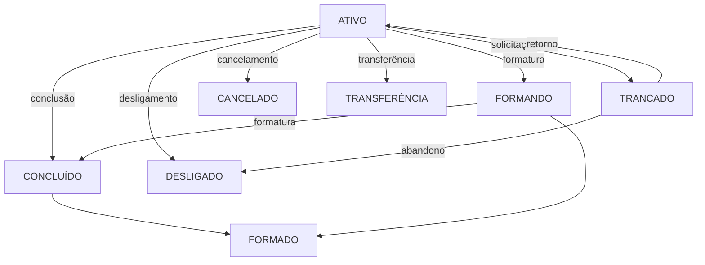

# Domínio do Sistema — sigaa-sigra-retencao

> Gerado pelo Detetive em 2026-05-01

---

## Glossário de Entidades

| Termo | Definição | Origem |
|-------|-----------|--------|
| **Aluno** | Estudante matriculado nos cursos da UnB | SIGAA/SIGRA |
| **Coorte** | Grupo de alunos ingressantes no mesmo ano e período | código |
| **Disciplina** | Componente curricular cursado pelo aluno | código |
| **Situação** | Classificação binária: FORMADO ou EVADIDO | código |
| **Tipo Integralização** | Categoria da disciplina: OB (obrigatória), OBR, OPT (optativa) | código |
| **Campus** | Unidade acadêmica: FGA (Faculdade Gamma), outros | código |
| **Fonte** | Sistema de origem: SIGAA ou SIGRA | código |
| **Modelo Preditivo** | Algoritmo ML treinado para prever evasão | código |

---

## Regras de Negócio Identificadas

### RN-001: Classificação de Situação do Aluno

> Um aluno é classificado como **FORMADO** se seu `status_discente` for:
> - ATIVO - FORMANDO
> - CONCLUÍDO
> - Formatura
> - FORMADO
>
> Caso contrário, é classificado como **EVADIDO**.

**Localização:** `tratamento_dados.R:16-18`
**Confiança:** 🟢 CONFIRMADO

---

### RN-002: Validação de Coorte para Treinamento

> Uma coorte (ano_ingresso + periodo_ingresso + opção) é válida para treinamento **apenas se possuir alunos de ambas as situações** (FORMADO e EVADIDO).

**Localização:** `analisar-evasao-sigaa-sigra.R:135`
**Confiança:** 🟢 CONFIRMADO

**Justificativa:** Sem ambas as classes, não é possível construir matriz de confusão nem calcular F1-Score.

---

### RN-003: Critério de Aceitação de Modelo

> Um modelo preditivo é aceito apenas se seu **F1-Score >= 0.7** (70%).

**Localização:** `analisar-evasao-sigaa-sigra.R:177, 227, 266, 308, 349`
**Confiança:** 🟢 CONFIRMADO

**Origem (Git):** Commit `4f25547` — "Houveram várias correções, mas ultima foi o semestre do RPART que estava errado"

---

### RN-004: Separação por Tipo de Disciplina

> Modelos são treinados separadamente por **tipo de integralização**:
> - OB + OBR (obrigatórias)
> - OU OB + OBR + OPT (incluindo optativas)

**Localização:** `analisar-evasao-sigaa-sigra.R:57-58`
**Confiança:** 🟢 CONFIRMADO

**Origem (Git):** Commit `0dc8858` — "Incluido variável para faciliar o filtro de disciplinas obrigatorias ou optativas"

---

### RN-005: Separação por Campus

> Existem queries distintas para:
> - **FGA** (Faculdade Gamma)
> - **UnB** (demais campuses)

**Localização:** `data_source.R`
**Confiança:** 🟢 CONFIRMADO

---

### RN-006: Diferenças entre SIGAA e SIGRA

| Aspecto | SIGAA | SIGRA |
|---------|-------|-------|
| Identificador aluno | `matricula` | `id_pessoa` (mapeado como `matricula`) |
| Campus | filtro por `sigla_campus` | filtro por `sigla_campus` |
| Status válidos | CONCLUÍDO, CANCELADO, ATIVO-FORMANDO, DESLIGADO, FORMADO, Formatura, TRANCADO | Transferência, TRANCADO, Formatura, FORMADO, DESLIGADO, CONCLUÍDO, CANCELADO, ATIVO-FORMANDO |
| Opção | obrigatório | obrigatório |

**Localização:** `data_source.R:8-31`
**Confiança:** 🟢 CONFIRMADO

---

### RN-007: Exclusão de Cursos

> O curso "ENGENHARIA" (termo genérico) é **excluído** de todas as análises.

**Localização:** `data_source.R:18, 30, 44, 56`
**Confiança:** 🟢 CONFIRMADO

**Hipótese:** Há diversas engenharias específicas (Engenharia de Software, Engenharia Ambiental, etc.) que são incluídas. O filtro exclui apenas registros sem curso específico.

---

### RN-008: Treinamento por Curso e Opção

> Modelos são treinados **por curso + opção (turno)**:
> - loop externo: cursos (Ciências Políticas, etc.)
> - loop médio: opções (manhã, tarde, noite)
> - loop interno: coortes (ano + período)

**Localização:** `analisar-evasao-sigaa-sigra.R:91-442`
**Confiança:** 🟢 CONFIRMADO

---

### RN-009: Previsão Apenas para Alunos Ativos

> A previsão de evasão é executada **apenas para alunos com status = ATIVO**.

**Localização:** `analisar-evasao-sigaa-sigra.R:43-44, 586-593`
**Confiança:** 🟢 CONFIRMADO

**Origem (Git):** Commit `10c039e` — "Correção na estrutura de crianção do modelo. Contrução da estrutura de previsão. Testes FGA disciplinas obrigatórias."

---

## Máquina de Estado: Status Discente

**Transformação para Modelo:**
- FORMADO: {CONCLUÍDO, FORMANDO, Formatura, FORMADO}
- EVADIDO: {TRANCADO, CANCELADO, DESLIGADO, Transferência}

---

## Decisões de Design (ADRs Retroativos)

### ADR-001: Threshold de F1-Score >= 0.7

**Data:** Inferida do histórico Git
**Status:** Aceito

**Contexto:** O projeto busca identificar alunos em risco de evasão. Um modelo com F1 < 0.7 seria pouco confiável para ação preventiva.

**Decisão:** Threshold de 0.7 (70%) para aceitar modelos.

**Consequências:**
- Apenas ~30% das coortes geram modelos válidos (segundo commits)
- Alto custo computacional para baixo retorno inicial

---

### ADR-002: Exclusão de Engenharia Genérico

**Data:** Inferida do código
**Status:** Aceito

**Contexto:** Queries filtram `nome_curso NOT IN ('ENGENHARIA')`.

**Decisão:** Excluir registros sem curso específico identificado.

**Hipótese:** Curso "ENGENHARIA" é um placeholder para dados incompletos.

---

## Lacunas Identificadas 🔴

| Código | Descrição | Localização |
|--------|-----------|--------------|
| LAC-001 | Não há documentação sobre como os modelos são disponibilizados para uso | código |
| LAC-002 | Não há sistema de monitoramento de performance dos modelos em produção | código |
| LAC-003 | Credenciais de banco hardcoded — sem config externa | data_source.R:196-200 |
| LAC-004 | Não há validação de dados de entrada (query SQL) | - |
| LAC-005 | Funções duplicadas le_dados e le_dados1 | data_source.R:221, 231 |

---

## Fonte das Regras

| Fonte | Artefato |
|-------|----------|
| Código fonte | tratamento_dados.R, analisar-evasao-sigaa-sigra.R |
| Queries SQL | data_source.R |
| Histórico Git | 20 commits analisados |
| Queries SQL externas | SQL/*.sql |