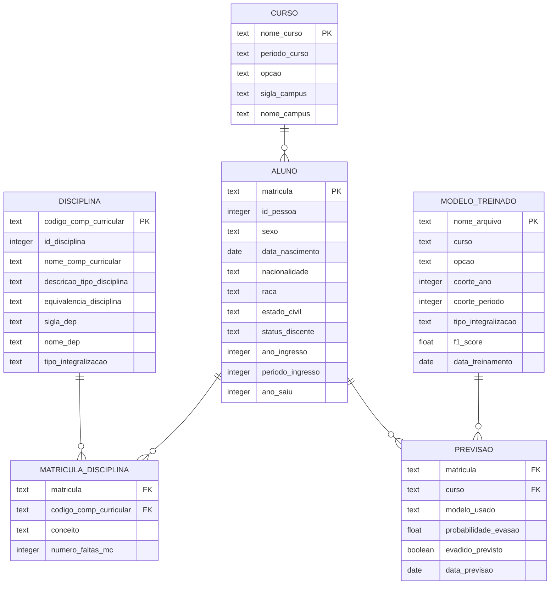

# ERD Completo — sigaa-sigra-retencao

> Gerado pelo Arquiteto em 2026-05-02

---

## Entidades Principais

---

## Detalhamento de Entidades

### ALUNO

| Campo | Tipo | Obrigatório | Descrição |
|-------|------|--------------|------------|
| matricula | text | Sim | Identificador único do aluno |
| id_pessoa | integer | Sim | ID interno na UnB |
| sexo | text | Não | M/F |
| data_nascimento | date | Não | Data de nascimento |
| nacionalidade | text | Não | Nacionalidade |
| raca | text | Não | Raça/Cor (censo) |
| estado_civil | text | Não | Estado civil |
| status_discente | text | Sim | Status atual |
| ano_ingresso | integer | Sim | Ano de ingresso |
| periodo_ingresso | integer | Sim | Período (1/2) |
| ano_saiu | integer | Não | Ano de saída |

### CURSO

| Campo | Tipo | Obrigatório | Descrição |
|-------|------|--------------|------------|
| nome_curso | text | Sim | Nome do curso |
| periodo_curso | integer | Não | Período atual |
| opcao | text | Não | Código da opção/turno |
| sigla_campus | text | Sim | Sigla do campus |
| nome_campus | text | Sim | Nome do campus |

### DISCIPLINA

| Campo | Tipo | Obrigatório | Descrição |
|-------|------|--------------|------------|
| codigo_comp_curricular | text | Sim | Código único da disciplina |
| id_disciplina | integer | Não | ID interno |
| nome_comp_curricular | text | Sim | Nome da disciplina |
| descricao_tipo_disciplina | text | Sim | Tipo do componente |
| tipo_integralizacao | text | Sim | OB/OBR/OPT |
| sigla_dep | text | Não | Sigla do departamento |

### MATRICULA_DISCIPLINA

| Campo | Tipo | Obrigatório | Descrição |
|-------|------|--------------|------------|
| matricula | text | Sim | FK → ALUNO |
| codigo_comp_curricular | text | Sim | FK → DISCIPLINA |
| conceito | text | Sim | Nota (A-E, O) |
| numero_faltas_mc | integer | Não | Faltas |

### MODELO_TREINADO

| Campo | Tipo | Obrigatório | Descrição |
|-------|------|--------------|------------|
| nome_arquivo | text | Sim | Nome do arquivo .Rdata |
| curso | text | Sim | Curso do modelo |
| opcao | text | Sim | Turno/opção |
| coorte_ano | integer | Sim | Ano da coorte |
| coorte_periodo | integer | Sim | Período da coorte |
| f1_score | float | Sim | F1-Score do modelo |
| data_treinamento | date | Sim | Data de treinamento |

### PREVISAO

| Campo | Tipo | Obrigatório | Descrição |
|-------|------|--------------|------------|
| matricula | text | Sim | FK → ALUNO |
| modelo_usado | text | Sim | Arquivo do modelo |
| probabilidade_evasao | float | Sim | Probabilidade de evasão |
| evadido_previsto | boolean | Sim | Classificação binária |
| data_previsao | date | Sim | Data da previsão |

---

## Relacionamentos

| De | Para | Cardinalidade | Descrição |
|----|------|----------------|------------|
| ALUNO | MATRICULA_DISCIPLINA | 1:N | Um aluno cursa várias disciplinas |
| CURSO | ALUNO | 1:N | Um curso tem vários alunos |
| DISCIPLINA | MATRICULA_DISCIPLINA | 1:N | Uma disciplina é cursada por vários alunos |
| ALUNO | PREVISAO | 1:N | Um aluno pode ter várias previsões |
| MODELO_TREINADO | PREVISAO | 1:N | Um modelo gera várias previsões |

---

## Fontes de Dados

| Tabela/View | Sistema | Descrição |
|-------------|---------|-----------|
| base_analitica.alunos_sigaa_sigra_27092022 | PostgreSQL | View unificada SIGAA+SIGRA |
| base_analitica.codigos_disciplinas_sigaa | PostgreSQL | Mapeamento de códigos |

---

## Escalas de Confiança

| Entidade | Confiança |
|----------|-----------|
| ALUNO | 🟢 CONFIRMADO |
| CURSO | 🟢 CONFIRMADO |
| DISCIPLINA | 🟢 CONFIRMADO |
| MATRICULA_DISCIPLINA | 🟢 CONFIRMADO |
| MODELO_TREINADO | 🟡 INFERIDO — baseado na estrutura de arquivos |
| PREVISAO | 🟡 INFERIDO — baseado na estrutura de arquivos CSV |

---

## Ver Também

- [data-dictionary.md](data-dictionary.md) — Dicionário de dados completo
- [traceability/spec-impact-matrix.md](traceability/spec-impact-matrix.md) — Matriz de impacto