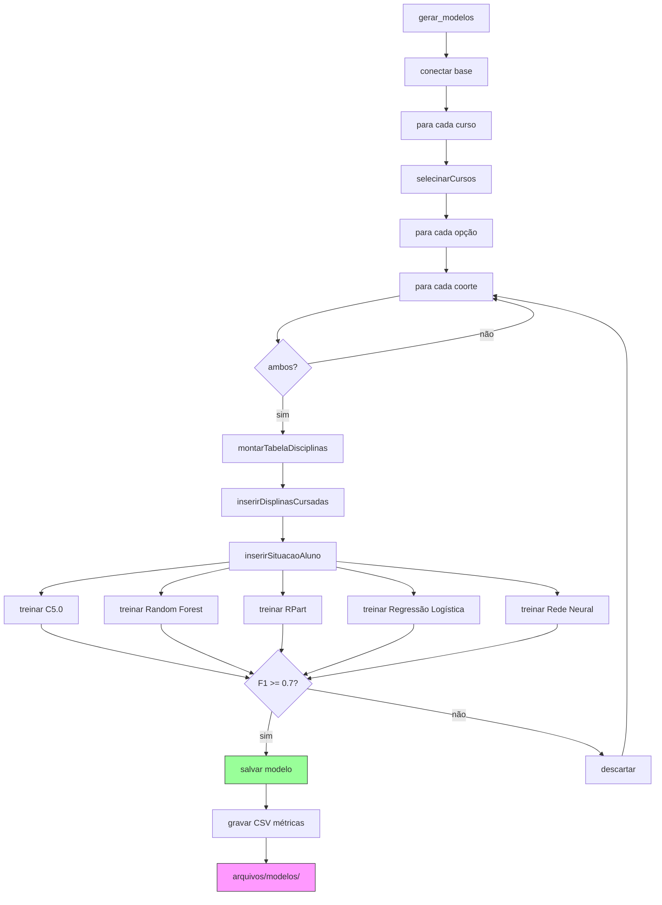
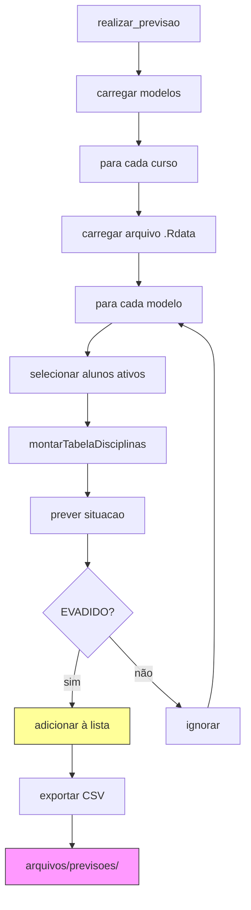

# Fluxo: analise_ml (Machine Learning)

## Função: gerar_modelos()

---

## Função: realizar_previsao()

---

## Modelos e Métricas

| Modelo | Biblioteca | Métrica |
|--------|------------|---------|
| C5.0 | C50 | F1-Score (byClass[7]) |
| Random Forest | ranger | F1-Score |
| RPart | rpart | F1-Score |
| Regressão Logística | glm | F1-Score |
| Rede Neural | h2o | F1-Score |

**Threshold:** F1 >= 0.7 para aceitar modelo