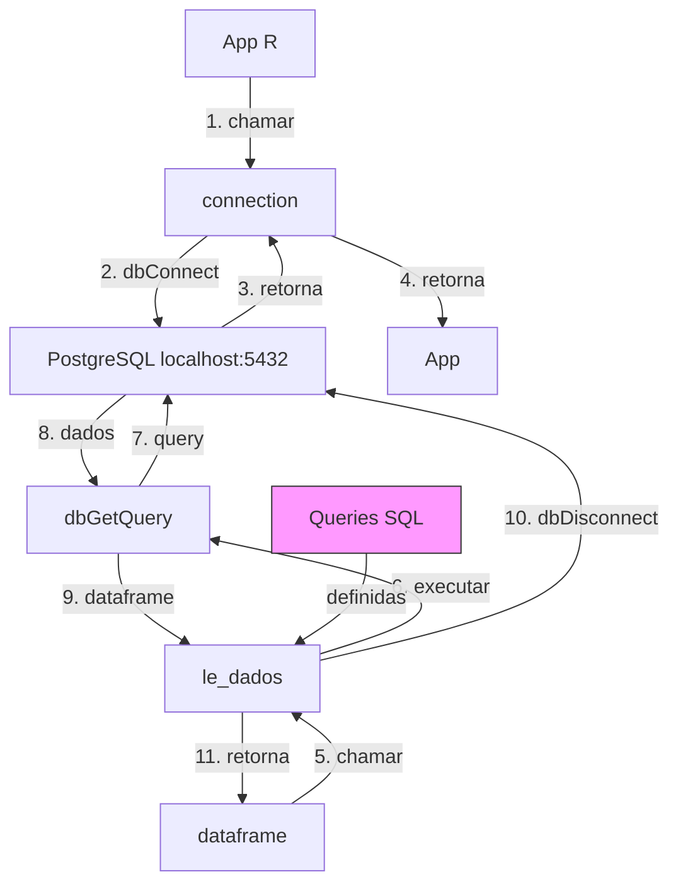

# Fluxo: data_source (Conexão PostgreSQL)

---

## Queries Disponíveis

| Query | Uso |
|-------|-----|
| sigaa | Treinamento FGA - SIGAA |
| sigra | Treinamento FGA - SIGRA |
| sigaa_ativos | Previsão alunos ativos FGA |
| sigaa_sigra_todos | Previsão todos FGA |
| sigaa_sigra_cp | Treinamento Ciência Política |
| sigaa_sigra_cp_todos | Previsão Ciência Política |
| sigaa_sigra_unb | Treinamento UnB (não-FGA) |
| sigaa_sigra_unb_todos | Previsão UnB (não-FGA) |