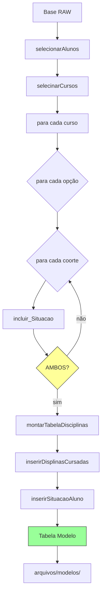
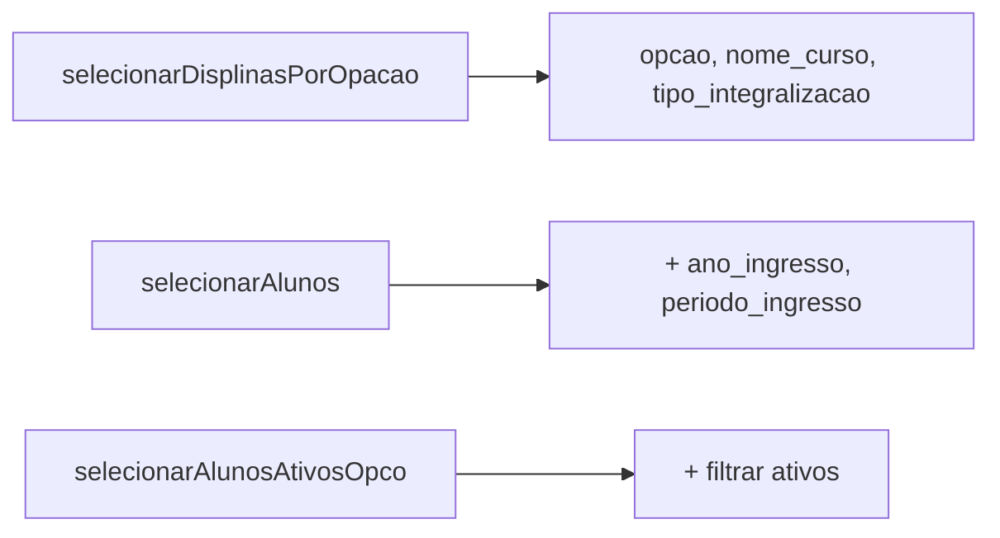
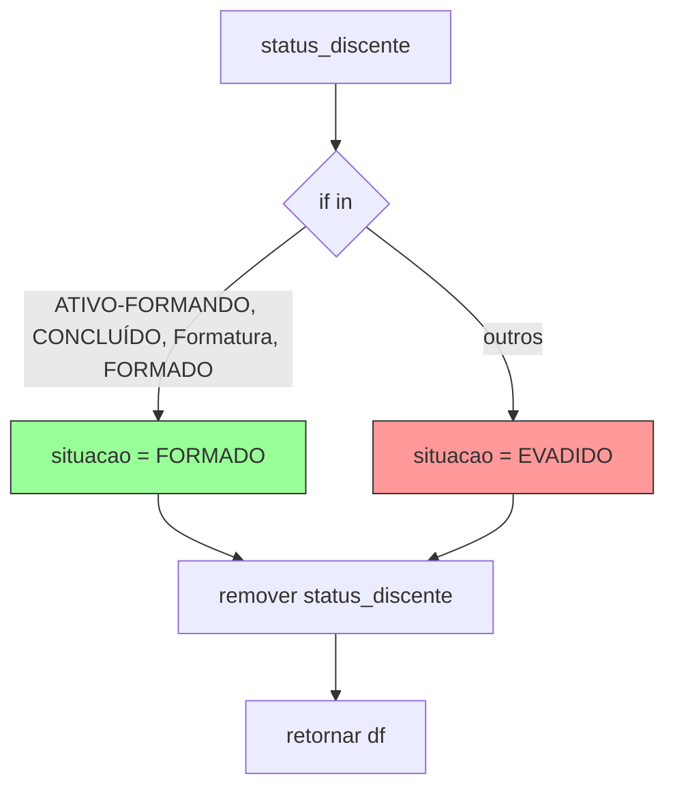

# Fluxo: tratamento_dados (Transformação)

```mermaid
graph TD
    A[Base RAW] --> B[selecionarAlunos]
    B --> C[selecinarCursos]
    C --> D[para cada curso]
    
    D --> E{para cada opção}
    E --> F{para cada coorte}
    
    F --> G[incluir_Situacao]
    G --> H{AMBOS?}
    H -->|não| F
    H -->|sim| I[montarTabelaDisciplinas]
    
    I --> J[inserirDisplinasCursadas]
    J --> K[inserirSituacaoAluno]
    K --> L[Tabela Modelo]
    
    L --> M[arquivos/modelos/]
    
    style H fill:#ff9,stroke:#333
    style L fill:#9f9,stroke:#333
```

---

## Funções de Filtro

```mermaid
graph LR
    A[selecionarDisplinasPorOpacao] --> B[opcao, nome_curso, tipo_integralizacao]
    C[selecionarAlunos] --> D[+ ano_ingresso, periodo_ingresso]
    E[selecionarAlunosAtivosOpco] --> F[+ filtrar ativos]
```

---

## Transformação: incluir_Situacao

```mermaid
graph TD
    A[status_discente] --> B{if in}
    B -->|"ATIVO-FORMANDO, CONCLUÍDO, Formatura, FORMADO"| C[situacao = FORMADO]
    B -->|outros| D[situacao = EVADIDO]
    C --> E[remover status_discente]
    D --> E
    E --> F[retornar df]
    
    style C fill:#9f9,stroke:#333
    style D fill:#f99,stroke:#333
```