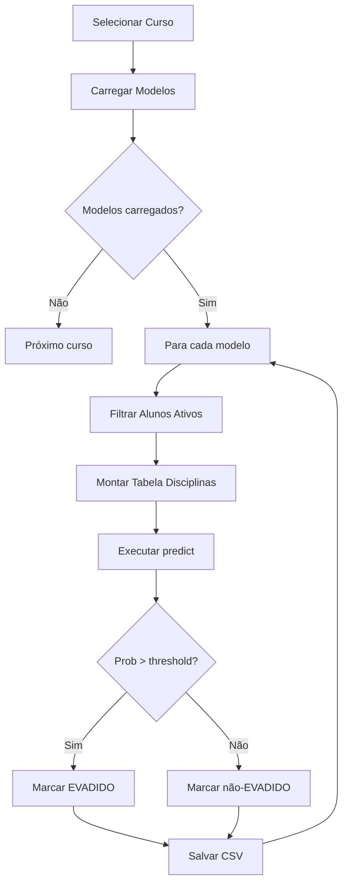

# analise_ml — Previsão de Evasão

## Visão Geral

Módulo de previsão que aplica modelos treinados a alunos ativos para identificar risco de evasão. Carrega modelos do disco, executa predições sobre alunos com status ATIVO e gera relatórios com os alunos classificados como prováveis evadidos.

## Responsabilidades

- Carregar modelos treinados do disco
- Selecionar alunos ativos para previsão
- Montar tabela de disciplinas para alunos ativos
- Executar predição usando modelos treinados
- Classificar alunos como prováveis evadidos
- Gerar arquivos de saída com previsões
- Registrar erros em log

## Interface

```r
realizar_previsao() -> void
```

A função não retorna valor. Resultados são salvos em arquivos:
- `arquivos/previsoes/previsao_evasao_[curso]_[opcao].csv`
- `arquivos/logs/log_prev_[curso]_[opcao].csv`

### Estrutura de Previsão

```
para cada curso:
  carregar modelos treinamento (arquivos/modelos/)
  para cada modelo válido:
    filtrar alunos ativos da coorte
    montar tabela disciplinas
    executar previsão (predict)
    marcar como EVADIDO se aplicável
    salvar em arquivo CSV
```

## Regras de Negócio

- **RN-009**: Previsão executada apenas para alunos com status = ATIVO 🟢
- Usa modelos treinados que atenderam F1 >= 0.7 🟢
- Cada modelo treinado para uma coorte específica aplica-se a alunos da mesma coorte 🟡

## Fluxo Principal



### Pipeline de Previsão

1. **Carregar modelos** — ler arquivos `.Rdata` de `arquivos/modelos/`
2. **Filtrar ativos** — via `selecionarAlunosAtivosOpco()`
3. **Montar tabela** — via `montarTabelaDisciplinas()` + `inserirDisplinasCursadas()`
4. **Executar predição** — `predict(modelo, novos_dados)`
5. **Classificar** — se probabilidade > 0.5 (padrão), marcar como EVADIDO
6. **Salvar resultados** — CSV em `arquivos/previsoes/`
7. **Registrar erros** — em `arquivos/logs/`

## Fluxos Alternativos

- **Modelo não encontrado**: pula para próximo modelo, registra erro em log 🟡
- **Aluno sem disciplinas**: não entra na previsão 🟡
- **Erro na predição**: registra em log, continua com próximo aluno 🟡

## Dependências

- **analise_ml-treinamento.md** — fornece modelos treinados 🟢
- **tratamento_dados.md** — funções de transformação 🟢
- **data_source-conexao.md** — conexão PostgreSQL 🟢

## Requisitos Não Funcionais

| Tipo | Requisito inferido | Evidência no código | Confiança |
|------|--------------------|---------------------|-----------|
| Performance | Previsão por aluno em < 1s | Sem evidência | 🔴 |
| Escalabilidade | Processa todos os ativos por curso | `analisar-evasao-sigaa-sigra.R:586-593` | 🟢 |
| Disponibilidade | Erros registrados em log | `analisar-evasao-sigaa-sigra.R` | 🟢 |

## Critérios de Aceitação

```gherkin
Dado que modelos treinados existem em arquivos/modelos/
Quando executar realizar_previsao()
Então deve carregar cada arquivo .Rdata

Dado que um modelo foi carregado com sucesso
Quando filtrar alunos ativos
Então deve retornar apenas alunos com status_discente = 'ATIVO'

Dado que um modelo e dados do aluno estão prontos
Quando executar predict(modelo, dados)
Então deve retornar probabilidade de evasão (0-1)

Dado que a probabilidade de evasão é > 0.5
Quando a previsão finalizar
Então o aluno deve ser marcado como EVADIDO no CSV de saída

Dado que a previsão resulta em erro
Quando o erro ocorrer
Então deve registrar o erro em arquivos/logs/log_prev_[curso].csv
```

## Prioridade

| Requisito | MoSCoW | Justificativa |
|-----------|--------|---------------|
| Carregar modelos do disco | Must | Sem isso, não há previsão |
| Filtrar ativos | Must | RN-009: apenas ativos |
| Executar predição | Must | Função principal |
| Salvar CSV de saída | Must | Entrega de valor |
| Log de erros | Should | Facilita troubleshooting |

## Rastreabilidade de Código

| Arquivo | Função/Trecho | Cobertura |
|---------|---------------|-----------|
| `analisar-evasao-sigaa-sigra.R:560-565` | Carregar modelos | 🟢 |
| `analisar-evasao-sigaa-sigra.R:586-593` | Filtrar ativos | 🟢 |
| `analisar-evasao-sigaa-sigra.R:595-600` | Executar previsão | 🟢 |
| `analisar-evasao-sigaa-sigra.R:43-44` | Query de ativos (sigaa_ativos) | 🟢 |

---

**Próximo:** etl-pentaho.md — Pipeline ETL. Digite **CONTINUAR** para prosseguir.