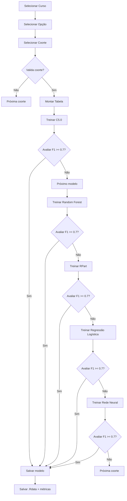

# analise_ml — Treinamento de Modelos

## Visão Geral

Módulo de machine learning que treina 5 tipos de modelos preditivos para cada coorte de curso, utilizando os dados transformados pelo módulo de tratamento. Executa validação por holdout e calcula métricas de desempenho, salvando apenas modelos que atingem threshold de F1-Score >= 0.7.

## Responsabilidades

- Treinar modelos C5.0 (árvore de decisão)
- Treinar modelos Random Forest (ranger)
- Treinar modelos CART (rpart)
- Treinar modelos Regressão Logística (glm)
- Treinar modelos Rede Neural (h2o.deeplearning)
- Avaliar desempenho via F1-Score
- Salvar modelos aprovados em arquivos .Rdata
- Registrar métricas de avaliação

## Interface

```r
gerar_modelos() -> void
```

A função não retorna valor. Resultados são salvos em arquivos:
- `arquivos/modelos/modelos_treinados_[curso]_[opcao].Rdata`
- `arquivos/resultado/modelo_resultado_[curso]_[opcao]_[coorte].csv`

### Parâmetros de Treinamento

| Modelo | Parâmetro | Valor |
|--------|-----------|-------|
| C5.0 | trials | 10 |
| Random Forest | num.trees | 10 |
| RPart | cp | 0.01 |
| Regressão Logística | family | binomial |
| Rede Neural | hidden | c(100) |
| Rede Neural | epochs | 1000 |

### Estrutura do Loop de Treinamento

```
para cada curso:
  para cada opção (turno):
    para cada coorte (ano + período):
      se (existe FORMADO E EVADIDO):
        montar tabela disciplinas
        treinar 5 modelos
        se (F1 >= 0.7):
          salvar modelo
```

## Regras de Negócio

- **RN-002**: Coorte válida para treinamento apenas se possui alunos de ambas as situações (FORMADO e EVADIDO) 🟢
- **RN-003**: F1-Score >= 0.7 para aceitar modelo 🟢
- **RN-004**: Modelos treinados separadamente por tipo de integralização (OB/OBR ou OB+OBR+OPT) 🟢
- **RN-008**: Treinamento por curso + opção + coorte 🟢
- Holdout: 70% treino, 30% teste (padrão caret) 🟡

## Fluxo Principal



### Pipeline de Treinamento

1. **Carregar dados** via `le_dados()` + `selecionarAlunos()` + `incluir_Situacao()`
2. **Montar tabela pivô** via `montarTabelaDisciplinas()` + `inserirDisplinasCursadas()`
3. **Separar treino/teste** (70/30 via caret)
4. **Para cada modelo**:
   - Treinar com dados de treino
   - Predizer com dados de teste
   - Calcular F1-Score via `confusionMatrix()`
   - Se F1 >= 0.7, salvar

## Fluxos Alternativos

- **Coorte com uma classe**: pula treinamento (não é possível calcular F1) 🟢
- **F1 < 0.7**: modelo não é salvo, próxima coorte 🟢
- **Erro durante treino**: erro não tratado, pula para próximo modelo 🟡

## Dependências

- **tratamento_dados.md** — fornece tabela pivô 🟢
- **caret** — framework de treinamento e avaliação 🟢
- **C50** — modelo C5.0 🟢
- **ranger** — Random Forest 🟢
- **rpart** — CART 🟢
- **h2o** — Rede Neural 🟢
- **data_source-conexao.md** — conexão PostgreSQL 🟢

## Requisitos Não Funcionais

| Tipo | Requisito inferido | Evidência no código | Confiança |
|------|--------------------|---------------------|-----------|
| Performance | Treinamento ~5-10 min por coorte | Sem evidência | 🔴 |
| Escalabilidade | Limite de 10 árvores (rf), 1000 épocas (h2o) | `analisar-evasao-sigaa-sigra.R` | 🟢 |
| Disponibilidade | Sem retry em falha de treino | Sem evidência | 🔴 |

## Critérios de Aceitação

```gherkin
Dado um dataset com colunas de disciplinas e target 'situacao'
Quando executar gerar_modelos()
Então deve treinar 5 modelos: C5.0, Random Forest, RPart, Regressão Logística, Rede Neural

Dado um modelo treinado
Quando calcular F1-Score via confusionMatrix
Então deve usar a classe positiva como referência

Dado que F1-Score de um modelo é >= 0.7
Quando o treinamento finalizar
Então deve salvar o modelo em arquivo .Rdata

Dado que F1-Score de um modelo é < 0.7
Quando o treinamento finalizar
Então NÃO deve salvar o modelo

Dado que uma coorte tem apenas alunos FORMADO (sem EVADIDO)
Quando executar gerar_modelos()
Então deve pular essa coorte (não é possível calcular F1)
```

## Prioridade

| Requisito | MoSCoW | Justificativa |
|-----------|--------|---------------|
| Loop por curso/opção/coorte | Must | Estrutura principal do treinamento |
| Validação de coorte | Must | Sem ela, não há F1 |
| Cálculo F1-Score | Must | Critério de aceitação |
| Salvar modelos aprovados | Must | Precisa existir para previsão |
| 5 tipos de modelo | Should | Permite comparar abordagens |

## Rastreabilidade de Código

| Arquivo | Função/Trecho | Cobertura |
|---------|---------------|-----------|
| `analisar-evasao-sigaa-sigra.R:91-442` | Loop de treinamento | 🟢 |
| `analisar-evasao-sigaa-sigra.R:177` | C5.0 + F1 | 🟢 |
| `analisar-evasao-sigaa-sigra.R:227` | Random Forest + F1 | 🟢 |
| `analisar-evasao-sigaa-sigra.R:266` | RPart + F1 | 🟢 |
| `analisar-evasao-sigaa-sigra.R:308` | Regressão Logística + F1 | 🟢 |
| `analisar-evasao-sigaa-sigra.R:349` | Rede Neural + F1 | 🟢 |
| `analisar-evasao-sigaa-sigra.R:135` | Validação coorte | 🟢 |

---

**Próximo:** analise_ml-previsao.md — Previsão de evasão. Digite **CONTINUAR** para prosseguir.