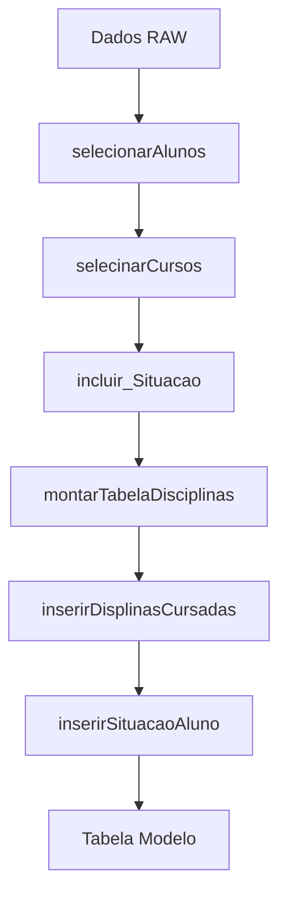

# tratamento_dados — Transformação de Dados

## Visão Geral

Módulo de transformação de dados brutos do SIGAA/SIGRA em formato estruturado para treinamento de modelos de machine learning. Cria uma matriz pivô onde cada linha representa um aluno e cada coluna representa a quantidade de vezes que cursou uma disciplina.

## Responsabilidades

- Classificar alunos em FORMADO ou EVADIDO
- Criar tabela pivô (aluno × disciplinas)
- Inserir contagens de disciplinas cursadas por aluno
- Filtrar alunos e disciplinas por critérios específicos
- Selecionar alunos ativos para previsão

## Interface

```r
incluir_Situacao(dados) -> dataframe
montarTabelaDisciplinas(dfAlunos, dfDisciplinas) -> dataframe
inserirDisplinasCursadas(dfDados, dfTabela) -> dataframe
inserirSituacaoAluno(dfDados, dfTabela) -> dataframe
selecionarDisplinasPorOpacao(dfDados, dfFiltro, tpDisciplina) -> dataframe
selecionarAlunos(dfDados, dfFiltro, tpDisciplina) -> dataframe
selecinarCursos(dfDados, tp_integralizacao) -> dataframe
selecionarAlunosAtivosOpco(dfDados, vIntegralizacao, vOpcao, vNome_Curso, vAno, vPerido) -> dataframe
```

### Funções de Interface

| Função | Entrada | Saída | Descrição |
|--------|---------|-------|------------|
| incluir_Situacao | dataframe com status_discente | dataframe com situacao | Transforma status em binário |
| montarTabelaDisciplinas | dfAlunos, dfDisciplinas | pivot table | Cria matriz aluno × disciplinas |
| inserirDisplinasCursadas | dfDados, dfTabela | dataframe | Preenche contagens |
| inserirSituacaoAluno | dfDados, dfTabela | dataframe | Insere target column |
| selecionarDisplinasPorOpacao | dfDados, dfFiltro, tpDisciplina | dataframe | Filtra por tipo |
| selecionarAlunos | dfDados, dfFiltro, tpDisciplina | dataframe | Filtra por curso/coorte |
| selecinarCursos | dfDados, tp_integralizacao | dataframe | Lista opções de curso |
| selecionarAlunosAtivosOpco | dados + filtros | dataframe | Filtra ativos para previsão |

## Regras de Negócio

- **RN-001**: Aluno com status `ATIVO - FORMANDO`, `CONCLUÍDO`, `Formatura`, `FORMADO` → `FORMADO` 🟢
- **RN-001**: Aluno com status diferente dos acima → `EVADIDO` 🟢
- **RN-004**: Modelos separados por tipo de integralização (OB/OBR ou OB+OPT) 🟢
- **RN-005**: Separação por campus (FGA, UnB) 🟢
- **RN-008**: Treinamento por curso + opção (turno) + coorte 🟢

### Mapeamento de Status para Situação

| status_discente | situacao |
|-----------------|----------|
| ATIVO - FORMANDO | FORMADO |
| CONCLUÍDO | FORMADO |
| Formatura | FORMADO |
| FORMADO | FORMADO |
| TRANCADO | EVADIDO |
| CANCELADO | EVADIDO |
| DESLIGADO | EVADIDO |
| Transferência | EVADIDO |

## Fluxo Principal



### Pipeline de Transformação

1. **selecionarAlunos** + **selecinarCursos** → filtra dados por curso/coorte
2. **incluir_Situacao** → adiciona coluna `situacao` (FORMADO/EVADIDO)
3. **montarTabelaDisciplinas** → cria estrutura pivô (matrícula × código_disciplina)
4. **inserirDisplinasCursadas** → preenche com contagens
5. **inserirSituacaoAluno** → insere coluna target `situacao`

### Estrutura da Tabela de Modelo

| Coluna | Tipo | Descrição |
|--------|------|------------|
| Linha (index) | character | matricula do aluno |
| Colunas 1..N | integer | contagem por disciplina |
| Coluna N+1 | factor | situacao (FORMADO/EVADIDO) |

## Fluxos Alternativos

- **Coorte sem alunos FORMADO**: retorna data.frame vazio 🟡
- **Aluno sem disciplinas cursadas**: não entra na tabela pivô 🟡
- **Disciplina nunca cursada**: coluna com valor 0 🟢

## Dependências

- **data_source-queries.md** — fornece dados brutos 🟢
- **tidyverse (dplyr)** — manipulação de dados 🟢

## Requisitos Não Funcionais

| Tipo | Requisito inferido | Evidência no código | Confiança |
|------|--------------------|---------------------|-----------|
| Performance | Pivot de 10k alunos × 100 disciplinas em < 10s | Sem evidência | 🔴 |
| Escalabilidade | Memoria adequada para datasets grandes | Sem evidência | 🔴 |

## Critérios de Aceitação

```gherkin
Dado um dataframe com coluna status_discente
Quando executar incluir_Situacao(dados)
Então deve adicionar coluna situacao com valores FORMADO ou EVADIDO

Dado que o status_discente é 'ATIVO - FORMANDO'
Quando executar incluir_Situacao
Então situacao deve ser 'FORMADO'

Dado que o status_discente é 'CANCELADO'
Quando executar incluir_Situacao
Então situacao deve ser 'EVADIDO'

Dado um dataframe de alunos e um de disciplinas
Quando executar montarTabelaDisciplinas
Então deve retornar pivot table com linhas=matricula, colunas=codigo_disciplina
```

## Prioridade

| Requisito | MoSCoW | Justificativa |
|-----------|--------|---------------|
| incluir_Situacao (RN-001) | Must | Regra central do modelo ML |
| montarTabelaDisciplinas | Must | Cria estrutura para treinamento |
| Pipeline completo | Must | Sem ele, não há modelo |
| Seleção por tipo (OB/OPT) | Should | Permite区分 obrigatório/optativo |
| Seleção por campus | Should | Permite análise por unidade |

## Rastreabilidade de Código

| Arquivo | Função | Cobertura |
|---------|--------|-----------|
| `tratamento_dados.R:16-18` | incluir_Situacao() | 🟢 |
| `tratamento_dados.R:25-42` | montarTabelaDisciplinas() | 🟢 |
| `tratamento_dados.R:44-55` | inserirDisplinasCursadas() | 🟢 |
| `tratamento_dados.R:57-68` | inserirSituacaoAluno() | 🟢 |
| `tratamento_dados.R:70-80` | selecionarDisplinasPorOpacao() | 🟢 |
| `tratamento_dados.R:82-97` | selecionarAlunos() | 🟢 |
| `tratamento_dados.R:99-110` | selecinarCursos() | 🟢 |
| `tratamento_dados.R:112-125` | selecionarAlunosAtivosOpco() | 🟢 |

---

**Próximo:** analise_ml-treinamento.md — Treinamento de modelos. Digite **CONTINUAR** para prosseguir.