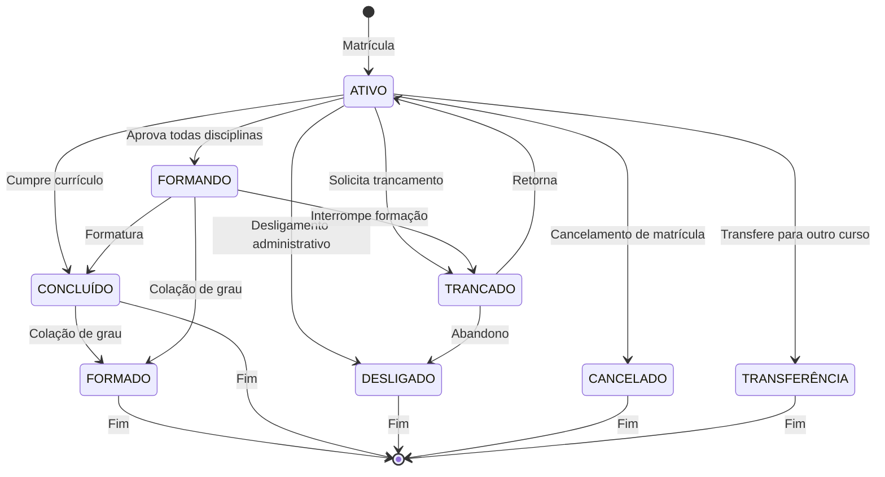
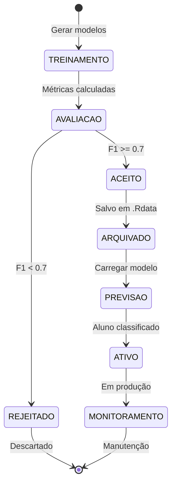
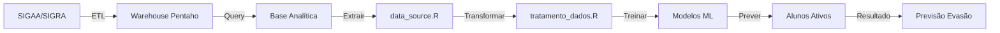

# Máquinas de Estado — sigaa-sigra-retencao

> Gerado pelo Detetive em 2026-05-01

---

## 1. Status Discente (Aluno)

### 1.1 Estados Possíveis

| Estado | Descrição |
|--------|-----------|
| ATIVO | Aluno matriculado cursando |
| ATIVO - FORMANDO | Aluno em fase de conclusão |
| CONCLUÍDO | Aluno que completou requisitos |
| FORMADO | Aluno que colou grau |
| Formatura | Status legacy |
| TRANCADO | Matrícula trancada temporariamente |
| CANCELADO | Matrícula cancelada |
| DESLIGADO | Aluno desligado do curso |
| Transferência | Aluno transferido para outro curso/instituição |

### 1.2 Diagrama de Transições



### 1.3 Transformação para Modelo ML

```
FORMADO ← {ATIVO - FORMANDO, CONCLUÍDO, Formatura, FORMADO}
EVADIDO ← {TRANCADO, CANCELADO, DESLIGADO, Transferência}
```

**Confiança:** 🟢 CONFIRMADO (tratamento_dados.R:16-18)

---

## 2. Status da Matrícula em Disciplina

### 2.1 Estados Possíveis

| Estado | Descrição |
|--------|-----------|
| APROVADO | Aprovado na disciplina |
| REPROVADO | Reprovado por nota |
| REPROVADO_FALTA | Reprovado por falta |
| MATRICULADO | Currently cursando |

### 2.2 Origem dos Dados

O campo `conceito` contém:
- Conceitos: A, B, C, D, E, O
- O = Ótimo, pode indicar aprovação

O campo `numero_faltas_mc` indica presença/faltas.

**Confiança:** 🟡 INFERIDO — baseado nos campos do banco

---

## 3. Status do Modelo Preditivo

### 3.1 Estados do Ciclo de Vida



### 3.2 Critérios de Transição

| Transição | Condição |
|-----------|----------|
| TREINAMENTO → AVALIACAO | Modelo treinado |
| AVALIACAO → ACEITO | F1-Score >= 0.7 |
| AVALIACAO → REJEITADO | F1-Score < 0.7 ou apenas uma classe |

**Confiança:** 🟢 CONFIRMADO (analisar-evasao-sigaa-sigra.R)

---

## 4. Fluxo de Dados do Sistema



---

## 5. Coorte (Ano/Período Ingresso)

### 5.1 Definição

Uma **coorte** é definida por:
- `ano_ingresso` (ex: 2019)
- `periodo_ingresso` (1 = primeiro semestre, 2 = segundo semestre)
- `opção` (código do turno/campus)

### 5.2 Validade para Treinamento

Uma coorte é **válida** para treinamento se:
- Possuir alunos com `situacao = FORMADO`
- Possuir alunos com `situacao = EVADIDO`

**Confiança:** 🟢 CONFIRMADO (analisar-evasao-sigaa-sigra.R:135)